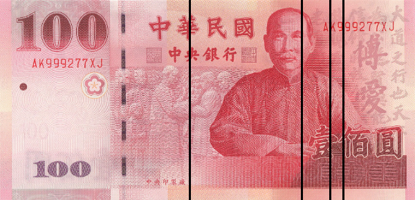

# Food Dollar Series（台灣食物美元系列）

The Food (New Taiwan) Dollar Series measures annual expenditures by Taiwan consumers on domestically produced food. This data series is composed of three primary series—the marketing bill series, the industry group series, and the primary factor series—that describe different aspects of the food-supply chain. The three series show three different ways to split up the same food dollar.

方法參照美國農業部 USDA ERS [Food Dollar Series](https://www.ers.usda.gov/data-products/food-dollar)，以行政院主計總處 **2021 年產業關聯表（163 部門）** 為基礎建立。

**📊 互動成果網頁 → <https://p09323028.github.io/Food-Dollar-Series/>**

---

## 2021 年結果摘要

每 **100 元** 食物消費支出的流向：

### Ⅰ 市場支出鏈 Marketing Bill

| 項目 | 佔比 |
|------|-----:|
| 農場份額 Farm share | **21.16%** |
| 市場份額 Marketing share | **78.84%** |

> 每花 100 元在食物上，僅約 21 元為農民實得的初級農產品淨值，其餘近 79 元支付給運輸、加工、批發零售與餐飲等中間環節。

### Ⅱ 產業群組鏈 Industry Group

| 產業群組 | 佔比 | | 產業群組 | 佔比 |
|------|-----:|---|------|-----:|
| 食品加工 Food processing | 18.87% | | 能源 Energy | 3.78% |
| 餐飲 Food service | 18.52% | | 包裝 Packaging | 2.43% |
| 批發 Wholesale | 18.22% | | 運輸 Transportation | 2.42% |
| 零售 Retail | 17.33% | | 農事服務 Agribusiness | 2.03% |
| 農業生產 Farm production | 12.98% | | 金融保險 Finance & insurance | 1.97% |
| | | | 廣告 Advertising | 1.27% |
| | | | 法律會計 Legal & accounting | 0.17% |

### Ⅲ 原始投入鏈 Primary Factor

| 生產要素 | 佔比 |
|------|-----:|
| 受僱人員報酬 Compensation | 45.76% |
| 營業盈餘 Operating surplus | 26.99% |
| 進口 Import（境外漏出） | 17.18% |
| 固定資本消耗 Fixed capital | 6.90% |
| 生產及進口稅淨額 Net taxes | 3.15% |
| 調整項目 Statistical adjustment | 0.03% |

> **口徑提醒**：三條鏈的「農場份額」定義不同 —— 市場支出鏈（21.16%）與產業群組鏈中農業生產（12.98%）＋農事服務（2.03%）屬不同口徑，不宜直接相比。

---

## Repo 內容

| 檔案 | 說明 |
|------|------|
| `2021FDS.ipynb` | 完整分析流程：產業關聯矩陣、三條金額鏈計算 |
| `index.html` / `food_dollar_2021.html` | 成果展示網頁（自包含，GitHub Pages 入口為 `index.html`） |
| `2021marketing.csv` | 市場支出鏈：各品項各階段農場價值佔比 |
| `2021scva.csv` | 產業群組鏈與原始投入鏈：各品項加值分解 |
| `*.png` | 鈔票分割圖（百元券視覺化） |
| `201102_Canning_*.pdf` | USDA Food Dollar 方法參考文獻 |

## 資料來源

行政院主計總處 2021 年產業關聯表：國產品交易表、生產者價格表、進口品交易表、國內運費表、商業加價表。
